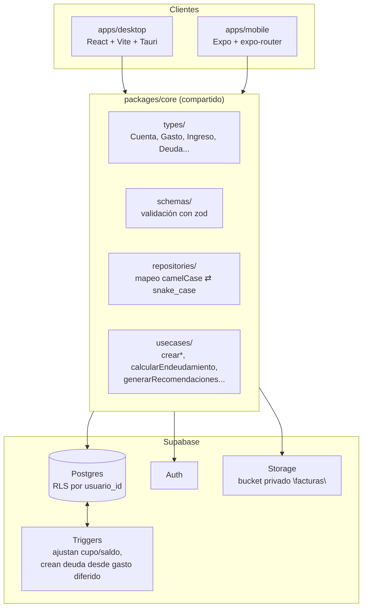

# gastos-app

App de finanzas personales para Ecuador: gastos, ingresos, tarjetas de crédito, cuentas bancarias, deudas y recordatorios, con la misma lógica de dominio compartida entre un panel de escritorio y una app móvil.

Monorepo con **app de escritorio** (React + Vite + Tauri), **app móvil** (Expo), **lógica de dominio compartida** (`packages/core`) y **backend** (Supabase: Postgres + Auth + Storage).

## Arquitectura



**Por qué está separado así:** ni un gasto ni un ajuste de saldo se calculan en el cliente. Todo lo que tiene que quedar consistente pase lo que pase (cupo de tarjeta, saldo de cuenta, deuda generada por un gasto diferido) vive como **trigger en Postgres**, no en código de React — así el dato es correcto sin importar si lo tocaste desde el panel de escritorio o desde el celular. `packages/core` es la única puerta de entrada a Supabase: valida con `zod` antes de insertar y traduce entre el `camelCase` de TypeScript y el `snake_case` de las tablas.

## Stack técnico

| Capa | Tecnología |
|---|---|
| Escritorio | React 18, Vite, Tauri, CSS propio (sin librería de UI) |
| Móvil | Expo, expo-router, React Native |
| Dominio compartido | TypeScript, Zod |
| Backend | Supabase (Postgres, Row Level Security, Auth, Storage) |
| Gráficos | Componentes propios en SVG/CSS (sin librería de charts) |
| OCR / lectura de recibos | Tesseract.js (imágenes) + pdf.js (PDF con texto) |

## Estructura del repo

```
apps/
  desktop/            panel de organización (React + Vite + Tauri)
    src/views/         una pantalla por módulo (Gastos, Ingresos, Tarjetas, Cuentas, Deudas, Categorías, Recordatorios, Resumen)
    src/components/    piezas reusables (gráfico de barras, tarjeta visual, ítems de movimiento...)
    src/lib/           lógica de UI que no es de dominio (semanas, catálogo de tarjetas, OCR, storage)
    src/assets/        imágenes reales de tarjetas y logos de banco
  mobile/             app Expo (login/registro + resumen — el grueso de los módulos vive en desktop)
packages/
  core/               tipos, schemas (zod), repositorios y casos de uso — usado por ambas apps
supabase/
  migrations/         una migración por cambio de esquema, en orden cronológico
  seed.sql            categorías base
```

## Primeros pasos

```bash
pnpm install
pnpm supabase:start        # levanta Supabase local (requiere Supabase CLI + Docker)
pnpm supabase:types        # genera packages/core/src/types/database.ts
```

Copiá las variables de entorno de ejemplo y completalas con la URL y la key (`anon`/`publishable`) de tu proyecto:

```bash
cp apps/mobile/.env.example apps/mobile/.env
cp apps/desktop/.env.example apps/desktop/.env
```

```bash
pnpm dev:mobile            # corre la app Expo
pnpm dev:desktop           # corre el panel de escritorio
```

**Migraciones**: corré `supabase db push` (o pegá cada archivo de `supabase/migrations/` en el SQL Editor de tu proyecto, en orden por fecha) antes de usar la app — varias funciones dependen de columnas y triggers que agregan las últimas migraciones.

> Todas las tablas tienen RLS activado con policies `auth.uid() = usuario_id`: cada quien ve y modifica únicamente lo suyo. Las categorías tienen una excepción: hay un puñado *globales* (`usuario_id = null`, sembradas en `seed.sql`) visibles para todos, además de las que cada usuario crea para sí.

## Módulos

### Resumen (inicio)

Panel principal: saludo, saldo del mes con ingresos/gastos, un gráfico de los últimos 7 días, una tarjeta de **salud financiera** (veredicto en base a endeudamiento e ingresos: "vas bien", "endeudamiento moderado/alto", "gastando más de lo que ingresás"), recomendaciones automáticas por reglas, y la actividad reciente (últimos gastos e ingresos mezclados).

### Gastos

- Formulario (detrás de un botón "+ Nuevo gasto") con monto (no acepta negativos), descripción (máx. 40 caracteres), categoría por chips de colores, cuenta/tarjeta, método de pago y factura adjunta.
- **Factura en PDF o imagen**: se sube a un bucket privado de Supabase Storage (`facturas/<usuario_id>/...`); se abre con una signed URL generada al momento de verla, no queda pública.
- **Importar estado de cuenta**: subís un PDF (con texto) o una foto/captura, un parser por reglas (sin IA) detecta fecha + descripción + monto de cada línea, mostrás una tabla de previsualización donde editás/descartás filas, y recién ahí se insertan como gastos.
- **Escanear recibo**: OCR local sobre una foto individual, autocompleta monto/fecha/comercio/categoría sugerida.
- **Vista por semanas**: 4 pestañas fijas (días 1–7, 8–14, 15–21, 22–fin de mes — la última se estira, sin 5ta pestaña), cada una con gráfico de barras por categoría + lista de totales (categoría, monto, % del total, acumulado del mes) + tabla de movimientos de esa semana, editable y eliminable por fila.
- **Método de pago "Diferido"**: al elegirlo, elegís a cuántos meses (3, 6, 9 y de ahí cada mes hasta 24). Un trigger en la base crea automáticamente la deuda asociada (monto, cuota = monto/meses, próximo pago), visible en Deudas como "Diferido automático". Si borrás el gasto, la deuda derivada se borra con él.

### Ingresos

Registro manual (mismos campos que Gastos, pero sin poder registrar egresos: todo monto suma) con categoría/fuente y el mismo manejo de "Otros" + detalle. Gráfico con **toggle por semana o por mes** (últimos 6 meses), con leyenda de color, mismo componente de gráfico que Gastos.

*Pendiente*: pestañas por semana con tabla editable línea por línea, al nivel de Gastos (hoy tiene el gráfico nuevo pero la tabla sigue siendo del mes completo).

### Tarjetas (crédito)

- Catálogo con **imágenes reales de 73 productos** de tres emisores — Banco Guayaquil (23: American Express, Visa, Mastercard/LATAM Pass), Diners Club Ecuador (28: Diners Club, TITANIUM Visa, TITANIUM Mastercard, Discover) y Produbanco (22: Visa, Mastercard y sus co-marcas Copa/Iberia/Avianca LifeMiles/Supermaxi) — agrupados por familia en la galería de selección. Cualquier producto sin imagen todavía cae a un diseño genérico (degradado + texto), nunca rompe.
- Cupo asignado y disponible se ajustan solos vía triggers al registrar un gasto o un pago — nunca se calculan en el cliente.
- Clic en la tarjeta abre un modal de "estado de cuenta": cupo disponible, barra de uso, y los movimientos (gastos + pagos) agrupados por fecha (Hoy/Ayer/fecha).
- Acciones rápidas: registrar pago, registrar gasto directo desde la tarjeta.

### Cuentas (ahorro / débito / efectivo)

Separadas de Tarjetas (antes vivían juntas). Banner horizontal con el **logo real del banco** (Banco Guayaquil, Pichincha, Produbanco, Diners Club — si no hay logo, cae a un color sólido de marca) y un botón de ojo para ocultar/mostrar el saldo. Acciones rápidas: registrar sueldo (ingreso) o gasto directo desde la cuenta; ambos ajustan el saldo solos.

### Deudas

Lista con saldo pendiente, próxima fecha de pago y registrar abono (baja el saldo). Se alimenta de dos formas: manual (formulario propio, con cuenta asociada) o automática desde un gasto diferido (ver Gastos). El nivel de endeudamiento (`Endeudamiento.nivel`) es cuotas mensuales de deudas activas ÷ ingreso del mes — alimenta el veredicto de salud financiera en Resumen.

### Categorías

CRUD completo, separadas por tipo (gasto / ingreso). Hay categorías globales sembradas (Comida, Transporte, Ocio, Servicios, Otros de cada tipo, Sueldo, Freelance, Regalo) visibles para todos pero de solo lectura; las que cada usuario crea son suyas: puede editarlas y borrarlas. Elegir "Otros" en Gastos/Ingresos habilita un campo de texto libre que se guarda junto al movimiento.

### Recordatorios

CRUD de recordatorios (pago, préstamo, tarjeta, otro), recurrentes o no, con checkbox de completado. Módulo pre-existente, no tocado en este trabajo.

### Presupuestos

Existe el modelo de datos y el repositorio en `packages/core`, pero **no tiene pantalla propia** en el desktop todavía.

## Base de datos

Migraciones, en orden:

| Archivo | Qué agrega |
|---|---|
| `20260826120000_gastos.sql` | Esquema base: `categorias`, `gastos`, `presupuestos` |
| `20260826130000_rls_policies.sql` | `usuario_id` + policies RLS en las tablas base |
| `20260826140000_finanzas_completas.sql` | `cuentas`, `ingresos`, `pagos_tarjeta`, `deudas`, `recordatorios` + triggers de cupo/saldo |
| `20260830120000_estilo_tarjeta.sql` | `cuentas.estilo` (id del producto del catálogo visual) |
| `20260830130000_eliminar_cuenta_con_movimientos.sql` | FKs con `ON DELETE SET NULL/CASCADE` — permite borrar una cuenta con movimientos |
| `20260830140000_categorias_crud.sql` | `categorias.tipo`/`usuario_id` + policies de insert/update/delete + siembra "Otros" |
| `20260830150000_gastos_factura_metodo_pago.sql` | `gastos.metodo_pago`/`factura_path` + bucket privado `facturas` + trigger de reajuste al editar un gasto |
| `20260831120000_banco_diners_club.sql` | `diners_club` como valor válido de `cuentas.banco` |
| `20260831130000_gasto_diferido.sql` | `gastos.meses_diferido` + `deudas.gasto_id` + trigger que crea la deuda desde un gasto diferido |

Todos los ajustes de saldo/cupo/deuda derivada son **triggers server-side**, nunca lógica de cliente — así valen igual para desktop y mobile.

## Diseño

Minimalista: pocos colores, mucho espacio en blanco, la jerarquía la dan tamaño y espaciado. Sin sombras ni degradados decorativos salvo el color de marca de banco/tarjeta. Estados vacíos, de carga y de error explícitos en cada listado. Montos siempre con 2 decimales.

## Estado actual / pendiente

- Ingresos: falta paridad completa con Gastos (pestañas por semana + tabla editable línea por línea).
- Mobile: sin cambios en este trabajo — sigue con solo login/registro y una pantalla de resumen.
- Hay un botón **"🗑️ Borrar todo (temporal)"** en la barra lateral del desktop, pensado solo para desarrollo/pruebas (borra todos los datos del usuario actual, con confirmación). Quitarlo (`App.tsx` + `packages/core/src/usecases/eliminarTodosLosDatos.ts`) antes de un lanzamiento real.
- `apps/desktop/src/assets/` tiene carpetas de respaldo con los archivos originales de tarjetas/logos tal como se recibieron (ya copiados y renombrados a donde los usa la app) — se pueden borrar cuando se confirme que no hacen falta.
